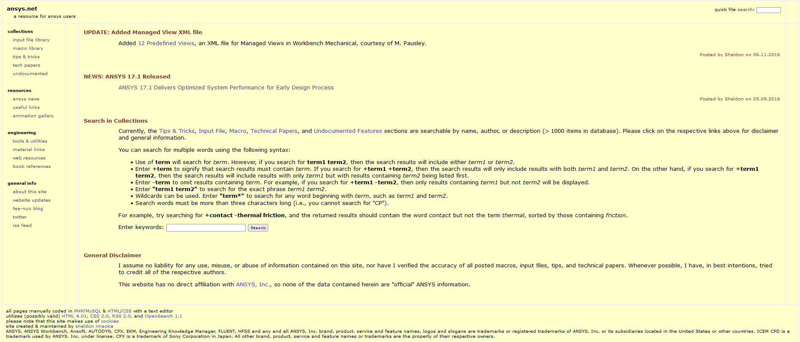

# Sheldon's ansys.net site contents

This repository contains the pdf and ansys files from "ansys.net" website.

## Organization

The repository contains 9 folders with roughly 90 files each. The files are roughly in order as you move through the folders, corresponding to the order in the CSV pulled from his site as the guide.

## Contributing

Basic knowledge of git is required.
Clone the repository to your desktop and edit files in text edidor (ide) of choice.
The site data are located at "\_site/\_data" folder. Title, Url and Description should be added for the content.

If you want to test the website locally, node must be installed. Run "npm install" to install the dependencies and run "npm start" to start the local server.

## Site Content List

The list of contents can be found on following website (work in progress).

[Static App on Netlify](https://ansys.netlify.app)
